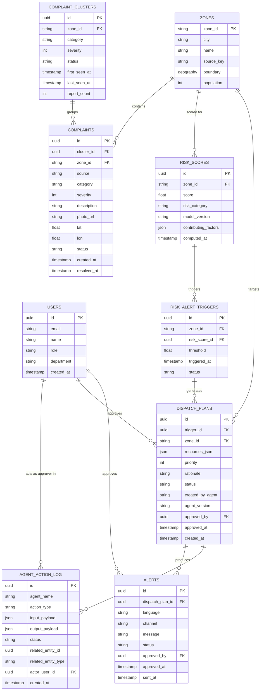

# Database Design (ER Diagram & Schema)
## CityPulse

**Version:** 1.0
**Stores:** PostgreSQL (operational) + BigQuery (analytical). This document covers both, clearly separated.

---

## 1. Storage Split Rationale

| Data | Store | Why |
|---|---|---|
| Raw + curated 311 / NOAA / Pune signals, risk score history, feature tables | BigQuery | Large volume, analytical/columnar access patterns, free-tier public dataset joins |
| Users, roles, complaints (operational lifecycle), clusters, dispatch plans, alerts, agent action log | PostgreSQL | Frequent small transactional writes/updates, referential integrity, row-level locking for approval workflows |

## 2. PostgreSQL — Entity Relationship Diagram

## 3. PostgreSQL Table Definitions (DDL-level detail)

### `users`
| Column | Type | Constraints |
|---|---|---|
| id | uuid | PK, default gen_random_uuid() |
| email | text | unique, not null |
| name | text | not null |
| role | text | not null, check in ('citizen_admin','analyst','dispatcher','admin') |
| department | text | nullable |
| firebase_uid | text | unique, not null |
| created_at | timestamptz | not null, default now() |

### `zones`
| Column | Type | Constraints |
|---|---|---|
| zone_id | text | PK (e.g. `nyc-cd-301`, `pune-ward-14`) |
| city | text | not null, check in ('nyc','pune') |
| name | text | not null |
| source_key | text | nullable — original source identifier (e.g. NYC community district code) |
| boundary | geography(POLYGON) | nullable (NYC has boundary shapefiles; Pune may use point/approximate polygon) |
| population | int | nullable |

### `complaint_clusters`
| Column | Type | Constraints |
|---|---|---|
| id | uuid | PK |
| zone_id | text | FK → zones.zone_id, not null |
| category | text | not null |
| severity | int | check 1–5 |
| status | text | not null, default 'open', check in ('open','in_progress','resolved') |
| first_seen_at | timestamptz | not null |
| last_seen_at | timestamptz | not null |
| report_count | int | not null, default 1 |

### `complaints`
| Column | Type | Constraints |
|---|---|---|
| id | uuid | PK |
| cluster_id | uuid | FK → complaint_clusters.id, nullable until Triage Agent assigns |
| zone_id | text | FK → zones.zone_id, nullable until classified |
| source | text | not null, check in ('citizen_app','nyc_311_import') |
| category | text | nullable until classified |
| severity | int | nullable, check 1–5 |
| description | text | not null |
| photo_url | text | nullable |
| lat | double precision | nullable |
| lon | double precision | nullable |
| status | text | not null, default 'received' |
| created_at | timestamptz | not null, default now() |
| resolved_at | timestamptz | nullable |

Index: `(zone_id, created_at)`, `(cluster_id)`.

### `risk_scores`
| Column | Type | Constraints |
|---|---|---|
| id | uuid | PK |
| zone_id | text | FK → zones.zone_id, not null |
| score | float | not null, check 0–100 |
| risk_category | text | not null, check in ('normal','watch','high') |
| model_version | text | not null |
| contributing_factors | jsonb | not null |
| computed_at | timestamptz | not null, default now() |

Index: `(zone_id, computed_at desc)` — supports "latest score per zone" and sparkline queries.

### `risk_alert_triggers`
| Column | Type | Constraints |
|---|---|---|
| id | uuid | PK |
| zone_id | text | FK → zones.zone_id |
| risk_score_id | uuid | FK → risk_scores.id |
| threshold | float | not null |
| triggered_at | timestamptz | not null, default now() |
| status | text | not null, default 'open', check in ('open','plan_created','resolved') |

### `dispatch_plans`
| Column | Type | Constraints |
|---|---|---|
| id | uuid | PK |
| trigger_id | uuid | FK → risk_alert_triggers.id |
| zone_id | text | FK → zones.zone_id |
| resources_json | jsonb | not null — e.g. `{"pumps":2,"crew":1}` |
| priority | int | not null, check 1–5 |
| rationale | text | not null |
| status | text | not null, default 'pending', check in ('pending','approved','rejected','edited_approved') |
| created_by_agent | text | not null, default 'dispatcher_agent' |
| agent_version | text | not null |
| approved_by | uuid | FK → users.id, nullable |
| approved_at | timestamptz | nullable |
| created_at | timestamptz | not null, default now() |

### `alerts`
| Column | Type | Constraints |
|---|---|---|
| id | uuid | PK |
| dispatch_plan_id | uuid | FK → dispatch_plans.id |
| language | text | not null, check in ('en','hi','mr') |
| channel | text | not null, check in ('sms','whatsapp') |
| message | text | not null |
| status | text | not null, default 'pending', check in ('pending','approved','sent','rejected') |
| approved_by | uuid | FK → users.id, nullable |
| approved_at | timestamptz | nullable |
| sent_at | timestamptz | nullable |

### `agent_action_log`
| Column | Type | Constraints |
|---|---|---|
| id | uuid | PK |
| agent_name | text | not null |
| action_type | text | not null |
| input_payload | jsonb | not null |
| output_payload | jsonb | not null |
| status | text | not null |
| related_entity_id | uuid | nullable |
| related_entity_type | text | nullable |
| actor_user_id | uuid | FK → users.id, nullable (null = fully autonomous step, no human actor yet) |
| created_at | timestamptz | not null, default now() |

Append-only; no UPDATE or DELETE permitted at the application layer (enforced via a Postgres `REVOKE UPDATE, DELETE` on this table for the app role).

## 4. BigQuery — Analytical Schema

| Dataset.Table | Description | Source |
|---|---|---|
| `citypulse.curated_complaints` | Normalized subset of NYC 311 records | `bigquery-public-data.new_york_311.311_service_requests` |
| `citypulse.weather_daily` | Normalized daily weather per station | `bigquery-public-data.noaa_gsod.gsod20*` |
| `citypulse.complaints_weather_joined` | Complaints joined to same-day nearest-station weather | Derived |
| `citypulse.zone_features_daily` | Feature-engineered table (rolling counts, weather aggregates) per zone per day | Derived via cuDF pipeline |
| `citypulse.pune_live_signals` | Hourly Pune rainfall/AQI | Open-Meteo, OpenAQ |
| `citypulse.risk_scores_history` | Append-only mirror of Postgres `risk_scores` for historical BI/Looker use | Synced from Postgres |

## 5. Data Retention
- Postgres operational tables: retained indefinitely for hackathon scope; production version would define a retention/archival policy (e.g., move resolved complaints >1 year old to BigQuery cold storage).
- BigQuery curated tables: retained per BigQuery default; no explicit TTL needed at hackathon data volumes.
